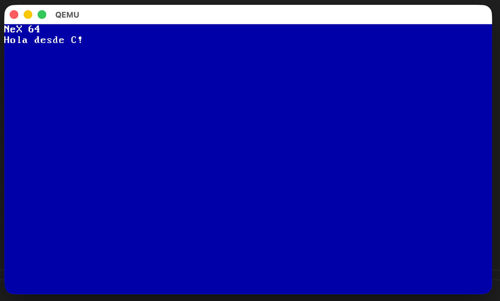

# NeX OS

> *"The people who are crazy enough to think they can change the world are the ones who do."* — Steve Jobs



**NeX** es un sistema operativo experimental, didáctico y bestialmente rápido, nacido del puro placer de programar a bajo nivel y entender el corazón de las máquinas. 

Este proyecto no busca competir con los gigantes modernos, sino sentarse sobre sus hombros. Nace como un homenaje directo a la era de **NeXTSTEP** —aquel momento en la historia de la informática donde la genialidad se cocinó fuera de los márgenes establecidos— y cierra un círculo poético: ser diseñado y compilado desde la herencia directa de esa revolución, hoy materializada en la arquitectura moderna de una Mac Mini.

NeX es un lienzo en blanco para explorar la gestión de memoria, los registros del procesador y la mística de ver arrancar un kernel propio desde el cero absoluto.

---

## ⚡ El Espíritu de NeX OS

* **Brutalmente Rápido:** Sin peso muerto, sin telemetría, sin capas innecesarias. Solo el código y el silicio.
* **Didáctico por Naturaleza:** Diseñado para ser leído, roto, modificado y comprendido bit a bit.
* **Mística de Garage:** Código con alma. Hecho por la diversión de domar el hardware y revivir la era dorada de la informática donde el software se sentía artesanal.

## 🧠 Inspiración Histórica

En 1985, fuera de Apple, Jobs fundó NeXT con la premisa de crear computadoras avanzadas para la educación y la ciencia. De ese ecosistema de software nacieron las bases de lo que hoy usamos a diario, la primera página web del mundo y la ingeniería que cambió la industria. 

**NeX** rescata esa chispa: la noción de que construir un sistema operativo propio es la forma definitiva de honrar la historia de la informática.

---

## 🛠️ Requisitos Previos (Para macOS / Apple Silicon M4)

Dado que estamos compilando desde un chip con arquitectura ARM64 pero apuntamos a una arquitectura destino x86_64 de 64 bits (*Bare-Metal*), necesitamos un entorno de compilación cruzada (*Cross-Compiler*).

Instalá las herramientas necesarias usando **Homebrew**:

```bash
brew install nasm qemu x86_64-elf-gcc

```

* `nasm`: El ensamblador para traducir nuestro código x86 a binario puro.
* `qemu`: El emulador de hardware hiperrápido para testear el OS de forma segura.
* `x86_64-elf-gcc`: Compilador de C puro optimizado para generar ejecutables limpios sin dependencias de macOS ni de Linux.

---

## 🚀 Cómo Compilar y Ejecutar

El proyecto incluye un script de automatización que compila los stages, genera la imagen unificada y lanza el emulador en un solo paso.

Asegurate de que el script tenga permisos de ejecución (`chmod +x build.sh`) y luego ejecutá:

```bash
./build.sh

```

---

## 🗺️ Mapa de Ruta (Roadmap)

* **[x] Stage 1:** Bootloader básico de 512 bytes e inicialización en Modo Real.
* **[x] Stage 2:** Carga de Boot Stage 2 desde disco. Configura GDT, habilita PAE y activa Long Mode, montando paginación de 64 bits con página gigante de 2MB.
* **[x] Transition:** Salto a 64 bits con nueva GDT exclusiva, inicialización de segmentos y limpieza de pantalla VGA con fondo azul.
* **[x] Stage 3:** Kernel (`kernel.c`) en C puro de 64 bits cargado en `0x10000` vía lectura extendida LBA. Imprime mensaje por VGA y entra en bucle infinito.

---

*Hecho solo por diversión, porque tirar código a bajo nivel es lo más parecido a la magia que tenemos.*

---

⚓ [Volver a helloworld.com.ar](https://helloworld.com.ar)
